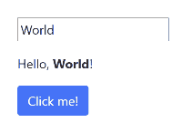
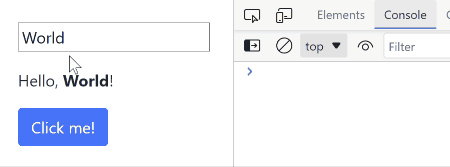
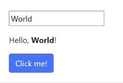

# Getting Started
{: .no_toc }

1. TOC
{:toc}

## Requisite tools

Elmish is a PureScript library, and PureScript works with
[NodeJS](https://nodejs.org/en/download/), and that's pretty much the only tool
you'll need to install upfront.

This tutorial assumes a basic familiarity with PureScript language as such, as
well as Node and its associated tooling.

## Initialize an empty project

1. Create an empty directory, run `npm init` to initialize a new Node project.
   The result should be a lone `package.json` file.
2. Run `npm install --save purescript spago react react-dom esbuild` to install:
    * `purescript` - the PureScript compiler.
    * `spago` - [the PureScript package
      manager](https://github.com/purescript/spago).
    * `react` and `react-dom` - the React library, on which Elmish is based.
    * `esbuild` - the fastest JavaScript bundler currently available.
3. Run `npx spago init` to initialize a new PureScript project in the directory.
   This should create a bit of scaffolding, including a couple of `*.dhall`
   files and an `src` directory with `Main.purs` in it.
4. Run `npx spago install elmish elmish-html` to install the Elmish library and
   its companion `elmish-html`.

## Minimal SPA scaffolding

1. Using your favourite text editor, create a file named `index.html` and put
   the following code in it:

   ```html
    <link rel="stylesheet" href="https://cdn.jsdelivr.net/npm/bootstrap@5.1.3/dist/css/bootstrap.min.css">
    <div id="app">The UI is not here yet</div>
    <script src="output/index.js"></script>
    <script>window.Main.main()</script>
   ```

   The second line is the container for the application to render itself in. The
   third line references the JavaScript bundle (result of your code
   compilation). The fourth line invokes the PureScript entry point function.

   **NOTE:** we're using Bootstrap for styling. Looks better that way.
   {: .callout }

2. Open `package.json`, find the `scripts` section in it, and add the following
   line:

   ```json
   "start": "spago build && esbuild ./output/Main/index.js --bundle --serve --servedir=. --outfile=output/index.js --global-name=Main"
   ```

   This command first builds your project (via `spago build`) and then starts
   the `esbuild` bundler to bundle the compilation results and simultaneously
   serve them with a built-in web server.

3. To verify, run `npm start`. This should, after a few seconds, display
   something along the lines of:

   ```text
   Local: http://127.0.0.1:8000/
   ```

   Open that address in a browser. You should see text "_The UI is not here
   yet_". If you don't see that, something is wrong with the setup so far.

## Hello World

To start your Elmish UI, first you'll need to define the five elements, as
explained in [the overview](index.md), - `State`, `Message`, `init`, `update`,
and `view`. We're going to put all of this in `Main.purs`:

```haskell
-- Nothing happens in our UI so far, so there are no messages
data Message

-- The UI is just static text, so there is no initial state
type State = Unit

-- Since there is no state, there is nothing to initialize
init :: Transition Message State
init = pure unit

-- Since there are no messages, the `update` function is also trivial
update :: State -> Message -> Transition Message State
update _ _ = pure unit

view :: State -> Dispatch Message -> ReactElement
view _ _ =
   H.div "p-4"
   [ H.text "Hello, "
   , H.strong "" "World!"
   ]
```

**NOTE**: the `H.div` function takes a CSS class as the first parameter, and so
does the `H.strong` function. This style works very well with Bootstrap (where
most elements have a class), but it's not the only choice. See [Rendering
HTML](dom-elements#atomic-css-support) for more.
{: .callout }

To make that compile, you'll need the following imports:

```haskell
import Elmish (Transition, Dispatch, ReactElement)
import Elmish.HTML.Styled as H  -- This is more convenient to import qualified
import Elmish.Boot (defaultMain) -- We'll need this in a moment
```

Now all that remains is to hook that up to the entry point. To do that, put the
following in `main`:

```haskell
main :: Effect Unit
main = defaultMain { def: { init, view, update }, elementId: "app" }
```

Now save and refresh your browser. Assuming you still have `npm start` running,
you should see "Hello, **World!**" on the screen.

## Interaction

Now let's add some interaction. We'll do the simplest kind for now: a button
click. To do that, we'll need a message to describe the click:

```diff
- data Message
+ data Message = ButtonClicked
```

And in order for the button to have a visible effect, we'll add some state for
it to change:

```diff
- type State = Unit
+ type State = { word :: String }
```

The `init` function should provide initial state of the right type:

```diff
  init :: Transition Message State
- init = pure unit
+ init = pure { word: "World" }
```

And the `update` function should react to the button click by updating the
state:

```diff
  update :: State -> Message -> Transition Message State
- update _ _ = pure unit
+ update state ButtonClicked = pure state { word = "Elmish" }
```

And finally, the `view` function should add a button:

```diff
  view :: State -> Dispatch Message -> ReactElement
- view _ _ =
+ view state dispatch =
     H.div "p-4"
+    [ H.div ""
       [ H.text "Hello, "
-      , H.strong "" "World!"
+      , H.strong "" state.word
       , H.text "! "
       ]
+    , H.button_ "btn btn-primary mt-3" { onClick: dispatch ButtonClicked } "Click me!"
     ]
```

If you refresh your browser now, you should see this:


**NOTE:** we just introduced the first prop (`onClick`) passed to a DOM
element (`button`). For a more detailed discussion of props, see
[Rendering HTML](dom-elements.md#event-handlers).
{: .callout }

## More complex events

The `onClick` event we used above is nice, but it's a limited example of an
event: it doesn't have any parameters, but most events do.

The `elmish-html` library models all events of standard DOM elements as an
effectful function (i.e. `EffectFn1`) taking a `Foreign` parameter, even though
the underlying value is actually React Synthetic Event. Mostly this is because
it's still a work in progress. Events may get a more interesting type in the
future.

But for now, the idea is to get the `Foreign` parameter and extract interesting
values from it via `readForeign`, which is a standard Elmish mechanism for
dealing with JS values of unknown nature ([see here for more on it](read-foreign.md)).

To illustrate this, let's add a textbox to our application to let the user edit
the text:

```diff
- data Message = ButtonClicked
+ data Message
+   = ButtonClicked
+   | WordChanged String

  type State = { word :: String }

  init :: Transition Message State
  init = pure { word: "World" }

  update :: State -> Message -> Transition Message State
  update state ButtonClicked = pure state { word = "Elmish" }
+ update state (WordChanged s) = pure state { word = s }

  view :: State -> Dispatch Message -> ReactElement
  view state dispatch =
    H.div "p-4"
+   [ H.input_ "d-block"
+     { type: "text"
+     , value: state.word
+     , onChange: mkEffectFn1 \f -> do
+         let parsed = readForeign f :: Maybe { target :: { value :: String } }
+         case parsed of
+           Nothing -> pure unit
+           Just e -> dispatch $ WordChanged e.target.value
+     }
    , H.div "mt-3"
      [ H.text "Hello, "
      , H.strong "" state.word
      , H.text "! "
      ]
    , H.button_ "btn btn-primary mt-3" { onClick: dispatch ButtonClicked } "Click me!"
    ]
```



But of course, this is a bit too much ceremony, so there is a special operator
`<?|` that takes care of the `case` and the `mkEffectFn1` parts for us:

```diff
- import Elmish (Dispatch, ReactElement, Transition)
+ import Elmish (Dispatch, ReactElement, Transition, (<?|))

...

   , onChange: dispatch <?| \f ->
      (readForeign f :: _ { target :: { value :: String } })
      <#> \e -> WordChanged e.target.value
```

Unfortunately, we still have to specify the shape of the record. Otherwise the
compiler won't be able to tell what we expect to find.

For frequently used patterns like this, it's often benefitial to extract them as
a function:

```haskell
eventTargetValue :: Foreign -> Maybe String
eventTargetValue f =
   (readForeign f :: _ { target :: { value :: String } })
   <#> _.target.value

...

   , onChange: dispatch <?| \f -> WordChanged <$> eventTargetValue f
```

## Effects

It is a rare UI that comes without _effects_ - something that happens outside
the UI, be it local storage, timers, communication with a server, and so on.

In Elmish effects are defined by the `update` function. Its return type
`Transition Message State` encodes the new ("updated") state and zero or more
effects that should happen as a result of this state transition (hence the name
`Transition`).

Let's add a simple effect as a result of our `ButtonClicked` message: output a
line to the console.

```diff
+ import Effect.Class.Console (log)
- import Elmish (Transition, Dispatch, ReactElement, (<?|))
+ import Elmish (Transition, Dispatch, ReactElement, forkVoid, (<?|))

...

  update :: State -> Message -> Transition Message State
- update state ButtonClicked = pure state { word = "Elmish" }
+ update state ButtonClicked = do
+   forkVoid $ log "Button clicked"
+   pure state { word = "Elmish" }
  update state (WordChanged s) = pure state { word = s }
```

If you refresh your browser now and open console in the developer tools, you
should see something like this:



The `forkVoid` function adds an effect to the current state transition. The
"void" suffix means that the effect does not produce any more messages.

But most effects do eventually produce a message. Think of a server interaction:
in most cases the server response has to affect the UI somehow. To achieve this,
use the function `fork` (without the "void" suffix).

Server communication is a bit too complicated for this tutorial, so let's add a
timer instead:

```diff
+ import Effect.Aff (Milliseconds(..), delay)
  import Effect.Class.Console (log)
- import Elmish (Dispatch, ReactElement, Transition, forkVoid, (<?|))
+ import Elmish (Dispatch, ReactElement, Transition, fork, forkVoid, (<?|))

...

  data Message
    = ButtonClicked
    | WordChanged String
+   | TimeoutElapsed

...

  update :: State -> Message -> Transition Message State
  update state ButtonClicked = do
    forkVoid $ log "Button clicked"
+   fork do
+     delay $ Milliseconds 1000.0
+     pure TimeoutElapsed
    pure state { word = "Elmish" }
  update state (WordChanged s) =
    pure state { word = s }
+ update state TimeoutElapsed =
+   pure state { word = state.word <> " after a while" }
```



**NOTE**: there are many more ways to work with effects. For more information
please see [the page about state transitions](transition.md#effects)
{: .callout }
